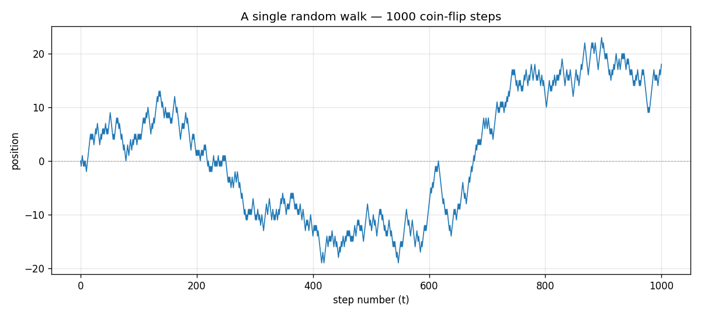

# 01 — What Is a Walk?

Before anything sophisticated, we need to see one walk happen.

## The setup

Imagine a person standing on a number line at position 0. They flip a fair coin:

- **Heads** → step one unit to the right (+1)
- **Tails** → step one unit to the left (−1)

Then they flip again. And again. A thousand times.

Where do they end up? The answer changes every time — that's what *random* means. But the *shape* of how they got there is what we want to look at.

## Run it

```bash
python walk.py
```

That produces this picture (one specific run, with the random seed fixed at 42 so you can reproduce it exactly):



And it prints:

```
final position after 1000 steps: 18
highest position reached:           23
lowest  position reached:           -19
```

## Reading the code

The whole thing is twelve lines of actual logic. Let's go through it.

```python
import numpy as np
import matplotlib.pyplot as plt
```

`numpy` is a numerical computing library — fast arrays of numbers and operations on them. `matplotlib.pyplot` is the plotting library. These are the two workhorses of scientific Python.

```python
N_STEPS = 1000
SEED = 42
```

How many coin flips, and a seed for the random number generator. Setting a seed makes the "randomness" reproducible: if you run the script twice with `SEED = 42`, you'll get the exact same walk both times. Set `SEED = None` to get a fresh, genuinely random walk every run.

```python
rng = np.random.default_rng(SEED)
steps = rng.choice([-1, 1], size=N_STEPS)
```

`rng` is a random number generator. `rng.choice([-1, 1], size=1000)` says: *give me an array of 1000 numbers, each one chosen at random from the list `[-1, 1]`*. That's our 1000 coin flips, encoded as ±1.

`steps` ends up looking like `array([ 1, -1, -1, 1, -1, 1, 1, ... ])` — a thousand ±1's.

```python
positions = np.concatenate([[0], np.cumsum(steps)])
```

This is the most important line. `np.cumsum(steps)` is the **cumulative sum** of the steps:

- After step 1, position = first step
- After step 2, position = first step + second step
- After step 3, position = first + second + third
- ...

So if `steps = [1, -1, -1, 1]`, then `cumsum(steps) = [1, 0, -1, 0]` — the running total at each point in time. That's exactly the walker's position after each flip.

We then prepend a `0` (the starting position before any flips) so the walk begins at the origin.

```python
fig, ax = plt.subplots(figsize=(10, 4.5))
ax.plot(positions, ...)
```

The rest of the script just plots `positions` against time and saves the picture. Nothing conceptually deep — just visualization scaffolding.

## What to notice in the picture

Stare at the plot for a moment. A few things are worth pointing out:

**1. It doesn't drift in any particular direction.** There's no "up trend" or "down trend" at the level of the underlying coin — every flip is fair. But by chance, this particular walk happens to wander up early, sink to around −20 in the middle, and climb back to +20 by the end. That entire shape is *noise*, not signal.

**2. It crosses zero many times** — but not as many as you'd guess. Looking at the plot, the walker passes through 0 maybe 6 or 7 times in 1000 steps. Random walks tend to "stick" on one side of zero for surprisingly long stretches.

**3. It's wiggly at every scale.** Zoom into any 100-step window and you see the same kind of wiggle as the whole 1000-step plot. This *self-similarity* is one of the reasons random walks turn out to be such a deep object — they're the discrete cousin of fractal curves.

**4. The position never gets very large compared to the number of steps.** This is the most important observation. The walker took **1000 steps**, but its position never exceeded **±25**. After all those flips, it ended up at +18 — which is tiny compared to the 1000 steps it took.

## The big hint

Why didn't 1000 steps take the walker farther? Because the +1's and the −1's mostly cancel out. Roughly half the steps push right, roughly half push left, and the leftovers are what determine where the walker ends up.

How big is "the leftovers"? Here's a number to remember:

$$\sqrt{1000} \approx 31.6$$

The walk's final position (+18), its highest point (+23), its lowest point (−19) — all comfortably within ±32 of the start. Not ±1000. Not ±100. About √1000.

This is not a coincidence. **The typical distance a random walk travels in $t$ steps grows like $\sqrt{t}$, not $t$.** That's the headline result we'll spend the next few folders building intuition for. But you've already seen it once, in this single picture.

## Try this

Open `walk.py` in your editor and try changing things. The script is small enough that nothing will break.

- **Change `SEED`** to something else (try `1`, `7`, `99`). Each seed gives a different walk. How different are the final positions? Are any of them close to ±1000?
- **Change `N_STEPS`** to `100`, `10_000`, `1_000_000`. Notice how the *typical magnitude* of the position scales — it grows, but slowly. Compare it to `√N_STEPS` each time.
- **Set `SEED = None`** and run the script several times in a row. You're now seeing genuine randomness — different walk every time.
- **Bias the coin** by changing `[-1, 1]` to e.g. `[-1, -1, 1]` (twice as likely to step left). What does the picture look like now? Is it still a "random walk" in the same sense?

Once you've stared at one walk for a while, head to [`02_many_paths/`](../02_many_paths/) — where we run a thousand walks side-by-side and start to see the *distribution* of where they end up.
